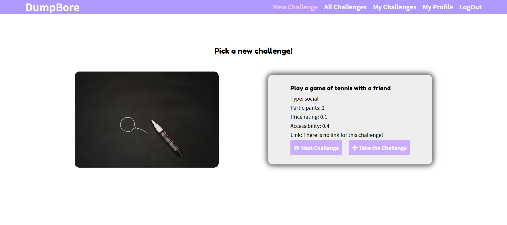

# Dump Bore
> SoftUni final project

## Table of contents
* [General info](#general-info)
* [Screenshot](#screenshot)
* [Technologies](#technologies)
* [How to use](#how-to-use)
* [Features](#features)
* [Inspiration](#inspiration)
* [Contributing](#contributing)

## Screenshot


## Technologie
* Angular 
* For random ideas [BoaredAPI](https://www.boredapi.com/)
* For images [UnsplashAPI](https://unsplash.com/developers)

## How to use

Edit src/environments/environment.ts and evnironment.prod.ts for your API
Currently applications is using environment.apiUrl varible from environment.ts

```bash
# Clone this repository
$ git clone https://github.com/themtrx/ng-final-project

# Go into the repository
$ cd ng-final-project

# Install dependencies
$ npm install

# Run the app
$ ng serve --open
```


## Features
Ready features for registered users (private area):
* Get a random challenge to do
* Save the challenge to your profile
* Get list of challenges saved by all registered users
* Get list only with your challenges

Unregistered users have access only home page (public area).
They have to chose either to log in or register.

To-do list:
* Filters for challenges lists
* Connect with cloudinary to save and show user profile picture

## Inspiration
This application is final project for Angular module in [SoftUni](https://softuni.bg/)
It is totally for educational purposes and experiments.

## Contributing
Please feel free to contribute and add more features
1. Fork it
2. Create your feature branch (`git checkout -b feature/fooBar`)
3. Commit your changes (`git commit -am 'Add some fooBar'`)
4. Push to the branch (`git push origin feature/fooBar`)
5. Create a new Pull Request
